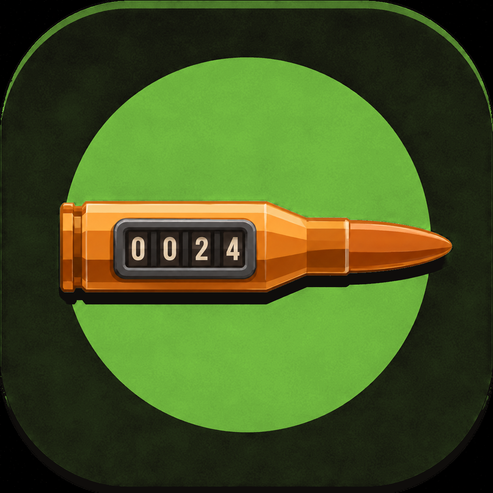

<p align="center">
  
</p>

<h1 align="center">Lead Log</h1>

<p align="center">
  A SwiftUI + SwiftData iOS app for tracking range sessions, firearms, and ammo inventory.
</p>

## Features

- **Log Session** — record rounds fired per firearm in a single range trip, with an optional target photo, ammo used, and notes. Rounds-fired input is validated (whole numbers, 1–99,999) and flags outlier values (e.g. a sudden 10,000 in a history of 500s) for confirmation before saving.
- **Inventory** — track firearms (manufacturer, model, category, serial number, rounds-since-service, primary ammo, photo) and ammo (caliber, brand, grains, type, quantity, low-stock threshold, compatible firearms).
- **History** — browse past sessions grouped by firearm, ammo, or date, with search across all three.
- **Settings** — haptic feedback toggle, on-device storage info (all data stays local — nothing leaves the device).
- Adaptive light/dark design system throughout; Dynamic Type support up to accessibility sizes.

## Requirements

- Xcode 16+
- iOS 17.0+ deployment target
- No external dependencies — pure SwiftUI/SwiftData, no SPM packages

## Building & Running

```bash
open LeadLog.xcodeproj
```

Or from the command line:

```bash
xcodebuild build -scheme LeadLog -destination 'platform=iOS Simulator,name=iPhone 17'
```

## Testing

```bash
xcodebuild test -scheme LeadLog -destination 'platform=iOS Simulator,name=iPhone 17'
```

- `LeadLogTests` — unit tests (Swift Testing) for business logic: rounds validation/outlier detection, ammo stock math, firearm service tracking, session summaries.
- `LeadLogUITests` — XCUITest coverage for the core flows and edge cases (empty states, validation, photo attachment, dialog handling).

## Project Structure

```
LeadLog/
  LeadLogApp.swift          App entry point, tab routing
  Models/Models.swift       SwiftData models (Firearm, AmmoEntry, LogEntry, ServiceRecord)
  Theme/                    Design system (colors, typography, reusable components)
  Components/               Shared views (camera capture, toasts, image storage)
  Views/
    LogSession/              Log Session tab
    Inventory/                Inventory tab (firearms + ammo)
    History/                   History tab (grouped session browsing)
    Settings/                  Settings tab
LeadLogTests/                 Unit tests
LeadLogUITests/                UI tests
```
